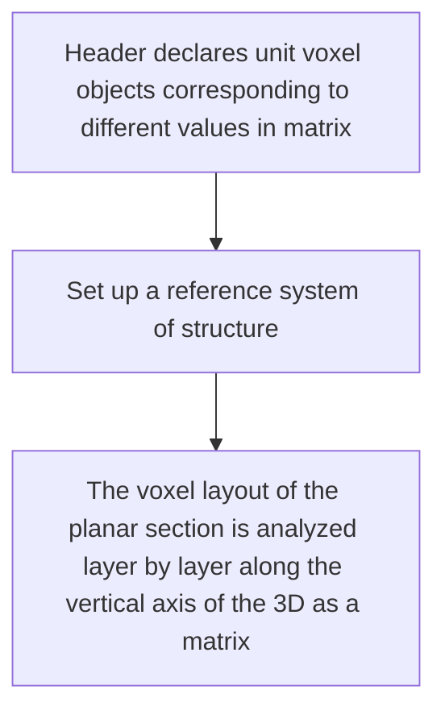
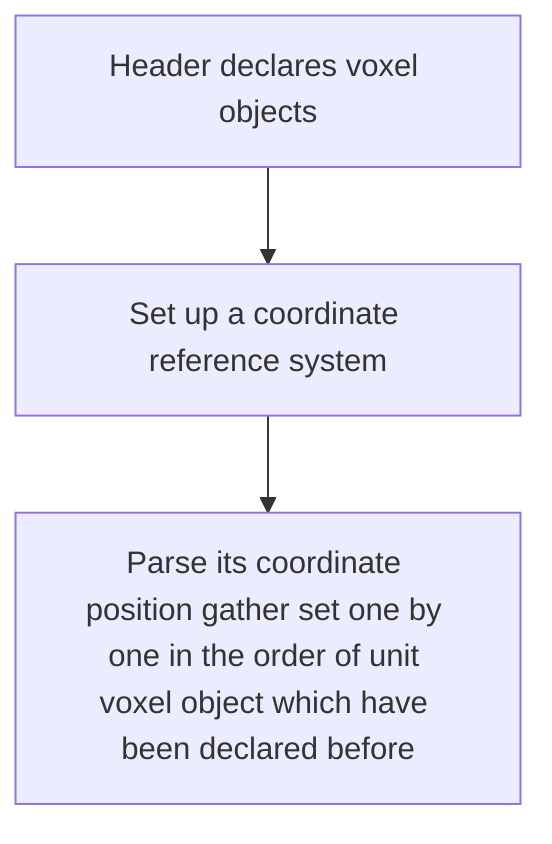
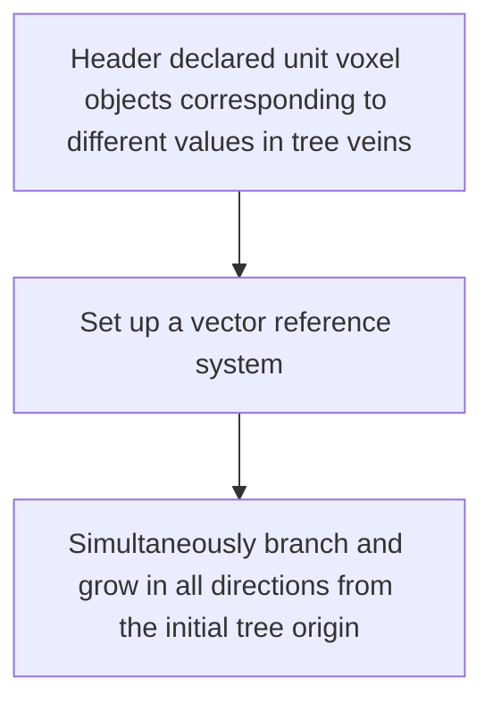

# Universal_Voxel_Model

Anisotropic general algorithms design cover storage and generation schemes for arbitrary voxel models.

The voxel model definition here refers to two things, one is the literal **Voxel Model**, and the other is the world layout data structure of **Unreal World**.

A unit voxel object is not necessarily cubes, but can also be a traditional model which composed of triangular faces.

##  🎯Target

The current main development tasks are in terms of traditional voxel models:

1. Committed to realizing the promotion as a **Universal Voxel Model File Format**, compatible with any modeling software and game development, such as 3dmax, Blender, Unreal Engine, Minecraft Structure and so on.

2. Different algorithm models can be transformed into each other or used at the same time.

## 🎨Design

Below I use specific examples to show the working logic of algorithms which have been designed.


### Matrix Structure Model



1. **Header declares unit voxel objects corresponding to different values in matrix**

   ```
   0 = NULL \\NULL is occupied and cannot be declared, which means that there is no voxel in the corresponding position of the matrix.
   1 = red
   2 = purple
   3 = bule
   4 = cyan
   5 = green
   ```

2. **Set up a reference system of structure**

   ```
   x - z - y \\Take the x-axis as the horizontal axis of the plane, the y-axis as the vertical axis of the plane, and the z-axis as the vertical axis of the 3D.
   ```

3. **The voxel layout of the planar section is analyzed layer by layer along the vertical axis of the 3D as a matrix**

   ```
   1 = [0 0 0;
        0 2 0;
        0 0 0]
   2 = [0 1 0;
   	 1 3 3;
   	 0 4 0]
   3 = [0 0 0;
   	 0 5 0;
   	 0 0 0]
   ```

> The advantage is that it is easy to perform 3D transformation of the voxel model.

### Object Coordinate Model



```json
{
    "objects":{
        "red":red, //Just express the data structure in json format, but not json, where red without quotes is an object instead of a string.
		"purple":purple,
        "bule":bule,
        "cyan":cyan,
        "green":green
    },
    "":["x", "z", "y"], //Set up a coordinate reference system, located at the polar corners. Take the x-axis as the horizontal axis of the plane, the y-axis as the vertical axis of the plane, and the z-axis as the vertical axis of the 3D, and the coordinates of the origin are (1, 1, 1). 0 is occupied, used to abolish the coordinate point.
    "models":{ //More complex algorithm date structure design can be used to pursue faster parsing and storage of coordinates gather.
        "red":[[1,2,1],[2,2,3]],
        "purple":[[2,1,2]],
        "bule":[[2,2,2],[3,2,2]],
        "cyan":[[2,2,1]],
        "green":[2,3,2]
    }
}
```

>  The advantage is the intuitive query of very huge structures coordinate gather.

### Origin Growth Model



1. **Header declared unit voxel objects corresponding to different values in tree veins**

    ```
    0 = NULL \\NULL is occupied, cannot be declared, and represents the branch of a unitless voxel object.
    1 = red
    2 = purple
    3 = bule
    4 = cyan
    5 = green
    ```

2. **Set up a vector reference system**

   ```
    x - z - y \\Take the x-axis as the front and rear positive direction, the y-axis as the left-right positive direction, and the z-axis as the up-down positive direction.
   ```

3. **Simultaneously branch and grow in all directions from the initial tree origin**

   | Symbol | Mean     |
   | ------ | -------- |
   | F      | Forward  |
   | B      | Backward |
   | L      | left     |
   | R      | right    |
   | A      | above    |
   | U      | under    |

   ① **Growth condition one**

   

   ```
   {
       5:{
           F:3
           B:1
           L:1
           R:4
           A:5
           U:2
       }
   }
   ```

   ②**Growth condition two**

   

   ```
   {
   	1:{
   		F:5:{
   			 F:3
           	 L:1
           	 R:4
           	 A:5
           	 U:2
   		}
   	}
   }
   ```

   > The advantage is that multi-threaded branches are performed concurrently during generation.

